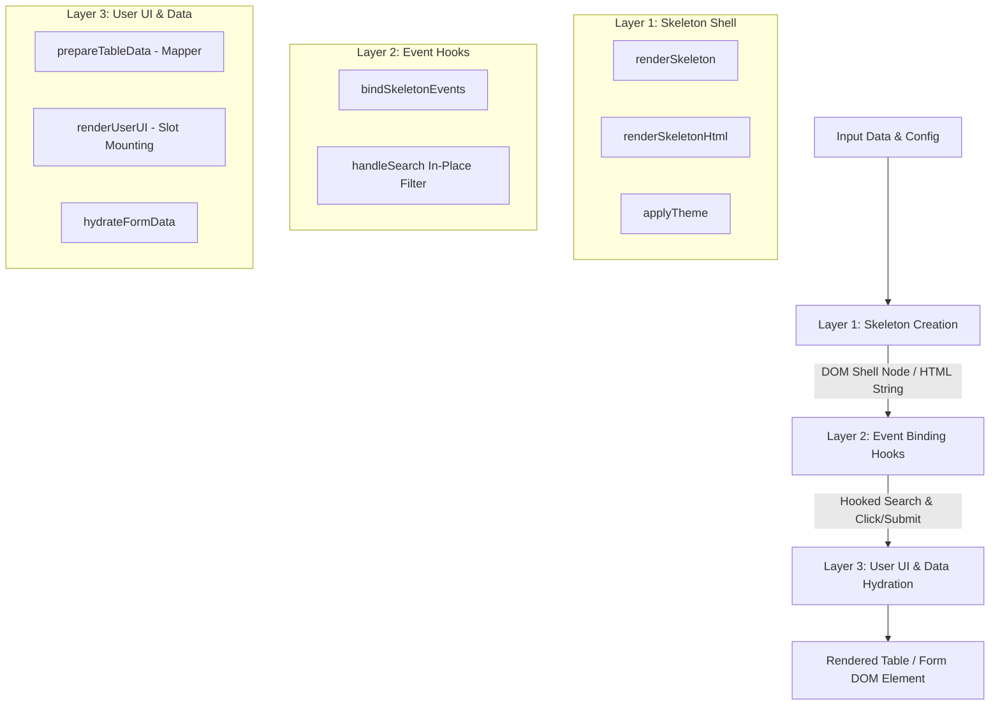

# ks-table-builder-from-json

> Zero-dependency, high-performance Web Components and 3-Layer JavaScript architecture for dynamic Data Tables and Vertical Forms built with Tailwind CSS design tokens.

[](https://www.npmjs.com/package/ks-table-builder-from-json)
[](https://opensource.org/licenses/ISC)
[](https://github.com/keshavsoft/ks-table-builder-from-json)

---

## 🌟 Key Features

- **🚀 Zero Runtime Dependencies**: Pure vanilla JavaScript & Custom HTML Web Components with zero third-party overhead.
- **🏗️ 3-Layer Orchestration Architecture**: Strict separation between Layout Shell (Skeleton), Event Binding Hooks, and User UI Hydration.
- **🔍 Built-in Real-Time In-Place Search**: Real-time filtering toolbar that refreshes the `tbody` slot container dynamically without re-mounting the DOM shell.
- **🔢 Automated Data Mapping**: Computes serial numbers (`serialNo`), formats row values, and standardizes record schemas transparently.
- **🎨 5 Built-in Themes**: `dark`, `extra-dark`, `medium`, `light`, and `extra-light` theme spec overrides out of the box.
- **💻 Dual Execution Modes**: Support for single-call synchronous rendering or 2-phase asynchronous skeleton mounting (ideal for REST API data fetching).
- **🌐 Custom Web Components**: Custom elements (`<ks-table-base>`, `<ks-cell-base>`, `<ks-wrapper-base>`) with inline attribute parser (`ks-*`).
- **🛠️ Built-in CLI**: Scaffolding and documentation CLI helper (`npx ks-table-builder-from-json`).

---

## 🏛️ Architecture Overview

The library operates on a strict **3-Layer Architectural Pattern** designed for high throughput, predictable event handling, and clean SSR/hydration separation.



---

## ⚡ Quickstart

### Installation

```bash
npm install ks-table-builder-from-json
```

Or run via CLI:

```bash
npx ks-table-builder-from-json init
```

---

## 📊 Table Controls

### Single-Call Rendering (`renderTable`)

Create a complete table with built-in search toolbar, data mapper, and row click handler in a single call:

```javascript
import { renderTable } from "ks-table-builder-from-json";

const tableContainer = document.getElementById("tableContainer");

const stockRows = [
    { StockItemName: "0.09/30mm", StockParentName: "FISH KNITTED FABRIC", Uom: "kgs" },
    { StockItemName: "0.11-25", StockParentName: "FISH KNITTED FABRIC", Uom: "kgs" },
    { StockItemName: "0.14/30mm", StockParentName: "COTTON FABRIC", Uom: "meters" }
];

const handleRowClick = ({ inRowElement, inEvent }) => {
    const itemName = inRowElement.children[1]?.textContent;
    alert(`Selected: ${itemName}`);
};

const tableElement = renderTable({
    inTheme: "dark", // "dark" | "extra-dark" | "medium" | "light" | "extra-light"
    inRows: stockRows,
    inOnRowClick: handleRowClick
});

tableContainer.appendChild(tableElement);
```

### 2-Phase Async Mount Pattern

Mount the table shell immediately, then hydrate data when your API call resolves:

```javascript
import { renderSkeleton, renderUserUI, bindSkeletonEvents } from "ks-table-builder-from-json";

const tableContainer = document.getElementById("tableContainer");

// Phase 1: Mount skeleton DOM immediately
const skeletonElement = renderSkeleton({ inTheme: "medium" });

bindSkeletonEvents({
    inTableElement: skeletonElement,
    inOnRowClick: ({ inRowElement }) => {
        console.log("Row clicked:", inRowElement);
    }
});

tableContainer.appendChild(skeletonElement);

// Phase 2: Asynchronously populate data when API returns
fetch("/api/stock-items")
    .then(res => res.json())
    .then(data => {
        renderUserUI({
            inSkeletonElement: skeletonElement,
            inRows: data
        });
    });
```

---

## 📋 Form Controls

### Single-Call Form Rendering (`renderForm`)

```javascript
import { renderForm } from "ks-table-builder-from-json";

const formContainer = document.getElementById("formContainer");

const fields = [
    { name: "username", label: "Username", type: "text", placeholder: "Enter username" },
    { name: "email", label: "Email Address", type: "email", placeholder: "name@example.com" }
];

const handleSubmit = ({ inFormData, inEvent }) => {
    console.log("Form Submitted Data:", inFormData);
};

const formElement = renderForm({
    inFields: fields,
    inData: { username: "Keshav", email: "keshav@example.com" },
    inOnSubmit: handleSubmit
});

formContainer.appendChild(formElement);
```

---

## 🏷️ Custom Web Components

Register and use custom HTML tags directly in HTML or JavaScript:

```html
<!-- Custom Table Element -->
<ks-table-base ks-theme="dark"></ks-table-base>

<!-- Custom Cell Element -->
<ks-cell-base ks-type="input" ks-placeholder="Enter item name..."></ks-cell-base>
```

---

## 📐 Parameter Naming Convention

All functions in this library follow a strict **Input Parameter & Local Variable convention**:

1. **Named Object Input**: All parameters are destructured from a single configuration object.
2. **`in`-Prefixed Parameters**: Input keys are always prefixed with `in` (e.g., `inRows`, `inSpec`, `inOnRowClick`).
3. **`local`-Prefixed Variables**: Immediately inside the function body, `in` parameters are assigned to `local`-prefixed variables.

```javascript
export const processData = ({ inRows, inConfig }) => {
    const localRows = inRows || [];
    const localConfig = inConfig || {};

    // Use localRows and localConfig throughout function body
    return localRows.map(row => ({ ...row, processed: true }));
};
```

---

## 🖥️ CLI Commands

```bash
# Print help menu
npx ks-table-builder-from-json --help

# Initialize sample project configuration
npx ks-table-builder-from-json init

# Display full API documentation
npx ks-table-builder-from-json docs

# View default JSON God Specs
npx ks-table-builder-from-json defaults

# View integration code snippets
npx ks-table-builder-from-json usage
```

---

## 📜 License

Distributed under the **ISC License**. Created with ❤️ by [KeshavSoft](https://github.com/keshavsoft).
