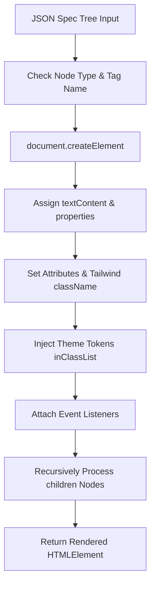

# 🧱 JSON-Driven Rendering & DOM Creation (`JSON_DRIVEN_RENDERING.md`)

[← Back to Main README](../README.md) | [Architecture Guide](ARCHITECTURE.md) | [API Reference](API.md) | [HTML Generation](HTML_GENERATION.md) | [Tailwind Classes](TAILWIND_CLASSES.md)

This document details the underlying engine in `ks-table-builder-from-json` that converts declarative JSON Specification trees into living DOM Element Nodes.

---

## 📖 Table of Contents

- [Overview](#-overview)
- [JSON Spec Tree Schema](#-json-spec-tree-schema)
- [DOM Element Builder (`domElementBuilder` / `buildSpecElement`)](#-dom-element-builder-domelementbuilder--buildspecelement)
- [God Specs Concept](#-god-specs-concept)
- [Event Listener Integration in JSON Specs](#-event-listener-integration-in-json-specs)
- [Code Examples](#-code-examples)

---

## 🌟 Overview

Rather than writing imperative DOM creation scripts (`document.createElement`, `setAttribute`, `appendChild`) throughout the codebase, `ks-table-builder-from-json` uses declarative JSON spec trees.

A single JSON spec object defines:
1. HTML tag type (`tagName`).
2. DOM attributes (`attributes`, including `class`, `id`, `slot`, etc.).
3. Direct DOM node properties (`properties`).
4. Event listeners (`events`).
5. Child node hierarchies (`children`).

---

## 📐 JSON Spec Tree Schema

Every node in a JSON spec tree adheres to the following specification:

```typescript
interface JsonSpecNode {
    tagName: string;                   // e.g. "div", "table", "tr", "input"
    textContent?: string;              // Optional inner text content
    attributes?: Record<string, any>;  // HTML attributes e.g. { class: "w-full", id: "search" }
    properties?: Record<string, any>;  // Direct DOM properties e.g. { value: "hello", checked: true }
    events?: Record<string, Function>; // Event listeners e.g. { click: (e) => {}, input: (e) => {} }
    children?: Array<JsonSpecNode | HTMLElement>; // Nested child spec trees or existing DOM nodes
}
```

---

## 🛠️ DOM Element Builder (`domElementBuilder` / `buildSpecElement`)

The core DOM builder resides in `webComponents/v2/domCreation/v2/index.js` and `webComponents/v2/domCreation/v2/buildSpecElement.js`.

### Recursive Transformation Pipeline:



### `buildSpecElement(inSpec)`

```javascript
import buildSpecElement from "./webComponents/v2/domCreation/v2/buildSpecElement.js";

const spec = {
    tagName: "div",
    attributes: { class: "p-4 bg-slate-900 rounded-lg shadow-md" },
    children: [
        {
            tagName: "h3",
            attributes: { class: "text-lg font-bold text-white" },
            textContent: "Dynamic Header from JSON"
        },
        {
            tagName: "button",
            attributes: { class: "mt-2 px-4 py-2 bg-indigo-600 text-white rounded hover:bg-indigo-700" },
            textContent: "Click Me",
            events: {
                click: (e) => alert("Clicked!")
            }
        }
    ]
};

const domNode = buildSpecElement(spec);
document.body.appendChild(domNode);
```

---

## 🏛️ God Specs Concept

A **God Spec** is a complete layout blueprint defined entirely as a JSON object.

### Table God Spec (`tableGodSpec.json`)

Located at `webComponents/v2/core/controls/table/v1/tableGodSpec.json`:

```json
{
  "tagName": "div",
  "attributes": { "class": "table-wrapper space-y-3" },
  "children": [
    {
      "tagName": "div",
      "attributes": { "class": "table-toolbar flex justify-between items-center bg-white p-3 rounded-lg border border-gray-200" },
      "children": [
        {
          "tagName": "input",
          "attributes": {
            "id": "tableSearchInput",
            "type": "text",
            "placeholder": "Search rows...",
            "class": "border border-gray-300 rounded px-3 py-1.5 text-sm w-64 focus:outline-none"
          }
        }
      ]
    },
    {
      "tagName": "table",
      "attributes": { "class": "w-full border-collapse border border-gray-300 rounded-lg overflow-hidden bg-white" },
      "children": [
        {
          "tagName": "thead",
          "attributes": { "class": "bg-gray-100 border-b border-gray-300" }
        },
        {
          "tagName": "tbody",
          "attributes": { "slot": "body", "class": "divide-y divide-gray-200 text-sm" }
        }
      ]
    }
  ]
}
```

By decoupling layout specifications into JSON templates:
- Any component structure can be customized or replaced at runtime.
- Layouts can be sent from a server API endpoint or stored in configuration files.
- Separation of Concerns between template layout and behavioral logic.

---

## ⚡ Event Listener Integration in JSON Specs

Event listeners attached in the `events` property are bound directly to the created DOM node using standard `addEventListener`:

```javascript
const specWithEvents = {
    tagName: "input",
    attributes: { type: "text", class: "border p-2 rounded" },
    events: {
        input: (e) => console.log("Current value:", e.target.value),
        keydown: (e) => {
            if (e.key === "Enter") console.log("Submitted!");
        }
    }
};
```

---

[← Back to Main README](../README.md) | [Architecture Guide](ARCHITECTURE.md) | [API Reference](API.md) | [HTML Generation](HTML_GENERATION.md) | [Tailwind Classes](TAILWIND_CLASSES.md)
